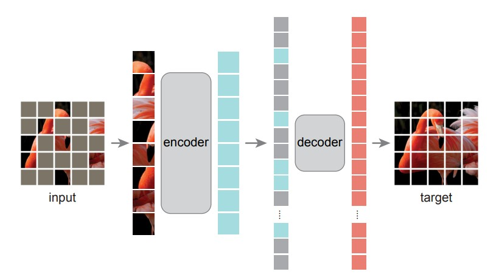
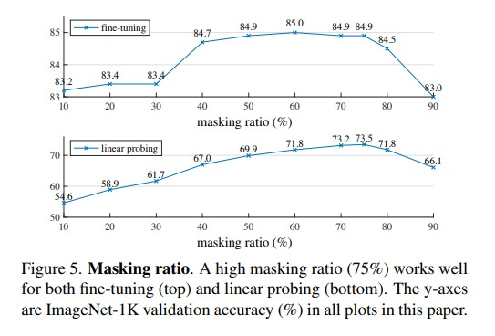
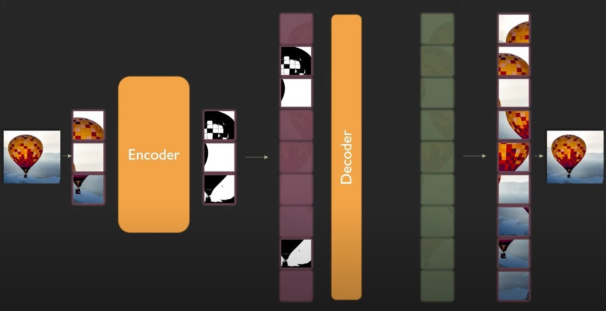
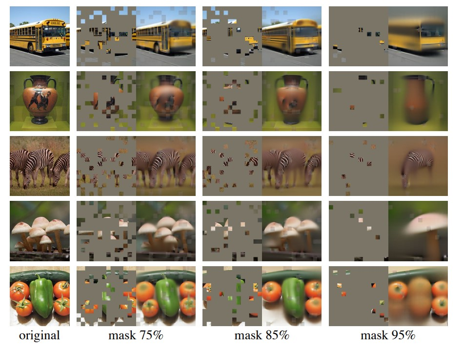
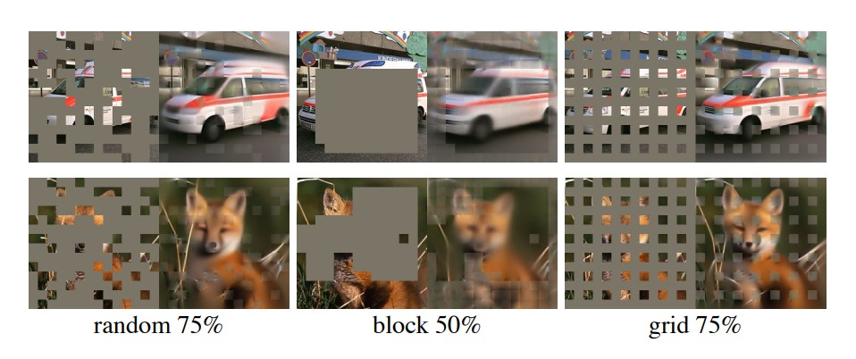

# Masked Autoencoders Are Scalable Vision Learners

## Context
#### Autoencoders
- Self-supervised learning method that aims to compress and then decompress the input data
- An encoder that learns a lower dimension, latent representation of the input data (i.e. key features of an image)
- A decoder that reconstructs the encoded representation into an output that resembles the input as closely as possible
- Validation is measured by comparing the output data with the original input data
- Used in pretraining Transformers, such as BERT, which helps the model understand semantics in NLP or visual representations in computer vision.
#### Masking
- Process of hiding part of the input data
- Different than the Mask parameter in the Transformer psuedocode
- BERT masked language modeling - you mask a word or phrase in your input, and try to predict that missing text
- For computer vision, you can mask patches of the input image
#### Vision Transformer (ViT)
- Uses transformer architecture that is extremely similar to the NLP transformers we have studied
- The tokens are patches of an image, instead of words or subwords, but the process of token embedding and positional embedding remain the same, as well as the remaining encoder-decoder architecture
- Can be used for image classification, object detection, or even question answering about a picture

## Problem
- The authors wanted to combine those three concepts to prove that masked autoencoders are scalable self-supervised learners for computer vision, particularly vision transformers
- In other words, they want to prove that by using an autoencoder to reconstruct masked images, they can pre-train a vision transformer that performs well on a variety of downstream vision tasks, and can also work well on very large datasets.
- By doing this self-supervised pretraining, the model will learn latent representations of the "visual world" (similar to a NLP model learning semantics)
- This pre-trained model can then be used for transfer learning for a variety of vision tasks down the road

## Summary of Approach
- Mask random patches of the input image and reconstruct the missing pixels. 
- Develop asymmetric encoder-decoder architecture
  - Encoder only operates on the visible, unmasked subset of patches, outputting a latent representation
  - Decoder reconstructs the original image from the latent representation and the mask tokens

## Architecture
#### Masking
  - Divide an image into regular, non-overlapping patches
  - Randomly sample a subset of patches and mask (i.e. remove) the remaining ones
  - The key to this architecture is using a high masking ratio (75% for ViT, 15% for BERT)
  - Using a high masking ratio eliminates redundancy, which creates a nontrivial self-supervised task that cannot be easily solved by simply extrapolating from nearby unmasked patches
  - Forces the model to learn the image representations more thoroughly.

#### Encoder
  - Only operates on a small subset (25%) of the full image
  - This allows us to train very large encoders with only a fraction of compute and memory (scalable)
  - Encoder embeds unmasked patches by a linear projection with added positional embeddings
  - Then processes the resulting set through a series of Transformer blocks to create a latent representation 

#### Decoder
  - The input to the decoder is the full set of tokens consisting of encoded visible patches and mask tokens
  - Each mask token is a learned vector that indicates the precense of a missing patch to be predicted. 
  - Processed through another series of transformer blocks
  - Each element in the decoder’s output is a vector of predicted pixel values representing a masked patch
  - Decoders are operating on the full set of image patches, they should be lightweight in order to reduce pretraining time. 
    - In the paper, the decoder the authors use has <10% computation per token than the encoder does. 

#### Reconstruction Target
  - The decoder’s output is reshaped to form a reconstructed image
  - Use mean squared error to calculate distance between the reconstructed and original image
  - Loss is only computed on masked patches, similar to BERT

### Visualization

## Results
#### Masking Ratio

#### Mask Sampling Strategy

- Overall, using this transformer architecture for this task allows you to train large models efficiently and effectively that are 3x faster and more accurate than convolutional architectures
- Transfer performance in downstream tasks outperforms supervised pretraining and shows promising scaling behavior.

## Questions
- What are some other differences between masked autoencoders for images and for text?
- What are some applications of masked autoencoding for vision learners?

## Resource Links
- How to Understand Masked Autoencoders (https://arxiv.org/abs/2202.03670)
- All you need to know about masked autoencoders (https://analyticsindiamag.com/all-you-need-to-know-about-masked-autoencoders/)
- Vision Transformers (ViT) for Self-Supervised Representation Learning: Masked Autoencoders (https://medium.com/deem-blogs/vision-transformers-vit-for-self-supervised-representation-learning-masked-autoencoders-692e2be2e775)
- Masked Autoencoders: A PyTorch Implementation (https://github.com/facebookresearch/mae)
- An Image is Worth 16x16 Words: Transformers for Image Recognition at Scale (https://arxiv.org/abs/2010.11929)

## Question Answers
#### Question 1
- Difference between masked autoencoding in vision and language
  - Language is information dense and requires sophisticated language understanding to predict missing words or sentences. Images have spacial redundancy and missing patches can be recovered with little high level understanding. To overcome this and encourage learning useful features, you mask a very high portion of random patches of an image. This reduces redundancy and requires a holistic understandiung
  - The decoder reconstructs pixels for images, which have lower semantic meaning, and reconstructs words for text, which have very high semantic meaning.
#### Question 2
- What are some applications of masked autoencoding for vision learners?
  - Masked autoencoding is mostly used for pre-training a visual transformer
  - However, there may be some tasks where reconstructing a partial image is useful, such as medical imaging or facial recognition
  - The pretraining process of masked autoencoding allows for transfer learning on a variety of different vision tasks as well

