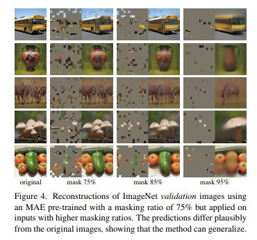

# Masked Autoencoders Are Scalable Vision Learners

## Definitions
### Autoencoders
- Self-supervised learning method that aims to compress and then decompress the input data
- An encoder that learns a lower dimension, latent representation of the input data (i.e. key features of an image)
- A decoder that reconstructs the encoded representation into an output that resembles the input as closely as possible
- Validation is measured by comparing the output data with the original input data
- Used in pretraining Transformers such as BERT
### Masking
- Process of hiding part of the input data
- Different than the Mask parameter in the Transformer psuedocode
- BERT masked language modeling - you mask a word or phrase in your input, and try to predict that missing text
- For images, you can mask patches of the input image
### Vision Transformer (ViT)
- Uses transformer architecture that is extremely similar to the NLP transformers we have studied
- The tokens are patches of an image, instead of words or subwords, but the process of token embedding and positional embedding remain the same, as well as the remaining encoder-decoder architecture
- Can be used for image classification, object detection, or even question answering about a picture

## Goal
- The authors wanted to combine those three concepts to prove that masked autoencoders are scalable self-supervised learners for computer vision, particularly vision transformers
- In summary, self-cupervised pretraining occured by inputting a masked image into an autoencoder, and outputting a reconstructed image as similar to the input as possible. 
- This pre-trained model can then be used for transfer learning for a variety of vision tasks down the road

## Current Computer Vision Approaches

## Summary: 
- Mask random patches of the input image and reconstruct the missing pixels. 
- Develop asymmetric encoder-decoder architecture
  - Encoder only operates on the visible, unmasked subset of patches
  - Decoder reconstructs the original image from the latent representation and mask tokens
- Masking a high percentage creates a nontrivial self supervised task
- Using this transformer architecture for this task allows you to train large models efficiently and effectively that are 3x faster and more accurate than convolutional architectures
- This approach allows for learning high-capacity models that generalize well
  - ViT-Huge model achieves 87.8% accuracy, which was among the best
- Transfer performance in downstream tasks outperforms supervised pretraining and shows promising scaling behavior.

## Introduction:
- The concept remains the same as in GPT and BERT - remove a portion of the data and learn to predict the removed content
- Difference between masked autoencoding in vision and language
  - Traditionally, convolutional networks were the standard in vision, which is no straightforward to include mask tokens
  - Language is information dense and requires sophisticated language understanding to predict missing words or sentences. Images have spacial redundancy and missing patches can be recovered with little high level understanding. To overcome this and encourage learning useful features, you mask a very high portion of random patches of an image. This reduces redundancy and requires a holistic understandiung
  - The decoder reconstructs pixels for images, which have lower semantic meaning, and reconstructs words for text, which have very high semantic meaning.
- Architecture:
  -  MAE masks random patches from the input image and reconstructs the missing patches in the pixel space
  - It has an asymmetric encoder-decoder design
  - Shifting the mask tokens to the small decoder results in a large reduction in computation
  - A high masking ratio increases accuracy and also decreases computation because the encoder processes a smaller portion of the image
  - Therefore, it is scalable, and you can learn high capacity models that generalize very well.
 
 ## Related Work
- Masked language modeling: BERT & GPT - scale excellently and generalize well to downstream tasks. 
- Autoencoding: has an encoder that maps an input to a laten representation and a decoder that reconstructs the input
- Masked image encoding: learn representations from images corrupted by masking

## Approach
- Have an encoder that maps the observed signal to a laten representation and a decoder that reconstructs the original signal from that latent representation
- The big difference is an asymmetric design where the encoder only works on the partial, unmasked signal.
- **Masking**
  - Divide an image into regular, non-overlapping patches
  - Randomly sample a subset of patches and mask (i.e. remove) the remaining ones
  - Using a high masking ration eliminates redundancy, which creates a more challenging task that cannot be easily solved by simply extrapolating from nearby unmasked patches. This is super interesting - actually making the problem harder leads to better and faster performance. (only need to encode 25% of patches). The optimal masking ratio for BERT is 15% compared to 75% here.
- **Masked Auto-Encoder**
  - Same encoder as a ViT, but only applied on visible, unmasked patches.
  - Embed patches by a linear projection with added positional embeddings
  - Then process the resulting set via a series of Transformer blocks
  - However, our encoder only works on a small subset (25%) of the full image.
  - Masked patches are removed, no masked patches are required
  - This allows us to train very large encoders with only a fraction of compute and memory
- **MAE decoder**
  - The input to the decoder is the full set of tokens consisting of encoded visible patches and mask tokens
  - Each mask token is a learned vector that indicates the precense of a missing patch to be predicted. Positional embeddings are included on the full set of patches so that the mask tokens can indicate which patches are missing.
  - Another series of transformer blocks
  - Only used during pretraining to reconstruct the image. Only the encoder is used to produce image representations
  - Decoder architecture can be flexibly designed in a manner that is independent of the encoder.
  - Decoders can be lightweight, so the full set of tokens for the reconstructed image are only processed by the decoder, which significantly reduces pre-training time. The decoder that the authors of this paper use has <10% computation per token than then encoder does
  - Each element in the decoder’s output is a vector of pixel values representing a patch
- **Reconstruction Target**
  - MAE reconstructs the input by predicting the pixel values for each masked patch
  - The last layer of the decoder is a linear projection whose number of output channels equals the number of pixel values in a patch. 
  - The decoder’s output is reshaped to form a reconstructed image. 
  - Our loss function computes the mean squared error (MSE) between the reconstructed and original images in the pixel space. 
  - We compute the loss only on masked patches, similar to BERT
- **Simple Implementation**
  - First, generate a token for every input task (by linear projection and an added positional embedding)
  - Randomly shuffle list of tokens and remove the last 75% of the list
  - After encoding, append a list of mask tokens to the list of encoded patches, and unshuffle the list
  - Decoder is applied to this full list
  - No sparse operations needed
 
 ## ImageNet Experiments
 - Self-supervised pre-training on the ImageNet-1K training set
 - The model infers missing patches to produce different yet plausible outputs. 

## Questions
- What are some other differences between masked autoencoders for images and for text?
- How could this random sampling be performed wiuthout sparse operations?

